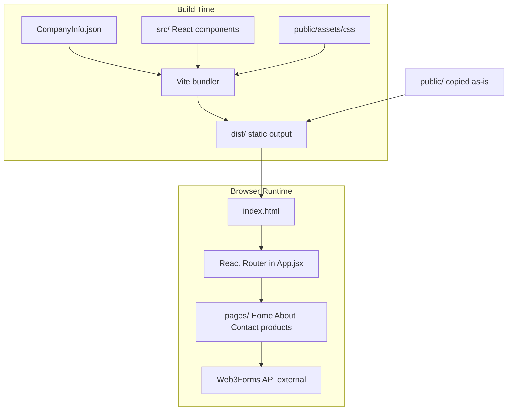

# MSL Architecture

Corporate marketing website for **MicroSysLogic**. Static **Vite + React 19 SPA** — no backend, database, or server-side rendering.

## Stack

| Layer | Technology |
|-------|------------|
| Build | Vite 8 (`@vitejs/plugin-react`) |
| UI | React 19 (JSX, no TypeScript) |
| Routing | React Router DOM 7 (`BrowserRouter`) |
| Carousels | Swiper 12 |
| CSS | Bootstrap, Bootstrap Icons, Boxicons, Remixicon (vendor assets in `public/`) |
| Animations | AOS (vendor JS in `public/`) |
| Fonts | Google Fonts — Inter & Poppins |
| Linting | ESLint 10 |
| Deploy | Vercel (SPA rewrites via `vercel.json`) |

## Directory Map

```
MSL/
├── index.html              # Vite HTML entry — mounts React at #root
├── vite.config.js          # Minimal Vite config (React plugin only)
├── vercel.json             # SPA fallback: all routes → /index.html
├── CompanyInfo.json        # Company contact info & stats (bundled at build)
├── DESIGN_SYSTEM.md        # UI/UX design tokens and component guidelines
├── package.json            # Scripts: dev, build, lint, preview
│
├── src/
│   ├── main.jsx            # React entry — imports vendor + custom CSS, mounts App
│   ├── App.jsx             # React Router route definitions
│   ├── index.css, App.css, slider.css
│   ├── components/         # Header, Footer, Hero, Clients, Stats, ScrollToTop, etc.
│   └── pages/              # Home, About, Contact, product verticals, Placeholder
│
├── public/
│   └── assets/
│       ├── css/            # base, header, hero, components, sections, footer
│       └── vendor/         # bootstrap, icons, aos, glightbox, etc.
│
├── dist/                   # Vite build output (gitignored)
└── .agents/
    ├── AGENTS.md           # Agent rules (notifications, doc pointers)
    ├── hooks/              # Cursor notification scripts
    └── docs/               # Agent-maintained project documentation (this folder)
```

## Request Flow



## Boot Sequence

1. `index.html` loads `/src/main.jsx` (dev) or bundled JS (prod)
2. `main.jsx` imports vendor CSS from `public/assets/` and mounts `<App />`
3. `App.jsx` wraps routes in `BrowserRouter`, renders persistent `Header` + `Footer`

## Routes

All routing is client-side via `react-router-dom` in `src/App.jsx`.

| Path | Page | Notes |
|------|------|-------|
| `/` | Home | |
| `/about` | About | |
| `/contact` | Contact | Web3Forms submission |
| `/products/manufacturing` | Manufacturing | Optional `:productId` for in-page scroll |
| `/products/ai` | AiSolutions | Optional `:productId` |
| `/products/defense` | Defense | Optional `:productId` |
| `/products/renewable` | RenewableEnergy | Optional `:productId` |
| `/products/hospitals` | SmartHospitals | Optional `:productId` |
| `/products/customization` | Customization | Optional `:productId` |
| `/products` | Placeholder | Not yet implemented |
| `/products/:slug` | Placeholder | Not yet implemented |
| `/services`, `/services/:slug` | Placeholder | Not yet implemented |
| `/training`, `/career` | Placeholder | Not yet implemented |
| `*` | Placeholder (404) | |

Dynamic `:productId` segments are used for scroll-to-section behavior only — no server data fetching.

## Data Flow

| Source | Consumers | Mechanism |
|--------|-----------|-----------|
| `CompanyInfo.json` | Footer, Stats, Contact | ES module import → bundled into JS at build |
| `/assets/img/...` | Header, Hero, product pages, etc. | Direct HTTP from `public/` (folder missing — see KNOWN_ISSUES.md) |
| Web3Forms API | Contact form | Client `fetch()` POST from `src/pages/Contact.jsx` |
| Swiper CSS | Product carousels | Imported from `node_modules` in components |

## Components

| Component | Role |
|-----------|------|
| `Header.jsx` | Navigation, logo, mobile menu |
| `Footer.jsx` | Contact info from CompanyInfo.json, links |
| `Hero.jsx` | Homepage hero with image carousel |
| `Stats.jsx` | Counter stats from CompanyInfo.json |
| `Clients.jsx` | Client logo strip |
| `ProofOfWork.jsx` | Portfolio / case study section |
| `SafeLoadAntiLeakage.jsx` | Product highlight section |
| `AboutPreview.jsx` | About teaser on homepage |
| `PageBreadcrumb.jsx` | Breadcrumb navigation on inner pages |
| `ScrollToTop.jsx` | Scroll to top on route change |

## Deployment

- **Build:** `npm run build` → outputs to `dist/`
- **Vercel:** `vercel.json` rewrites all paths to `/index.html` for SPA routing
- **Dev:** `npm run dev` runs `vite --host`

## What This Project Does NOT Have

- Next.js, API routes, middleware, or auth
- `.env` files or `import.meta.env` usage
- Database, file upload storage, or SSR
- Test framework configured

## Related Docs

- [PUBLIC_EXPOSURE.md](./PUBLIC_EXPOSURE.md) — what files are browser-visible
- [KNOWN_ISSUES.md](./KNOWN_ISSUES.md) — current gaps and security notes
- [CHANGELOG.md](./CHANGELOG.md) — agent-maintained change log
- [../../DESIGN_SYSTEM.md](../../DESIGN_SYSTEM.md) — UI design tokens
